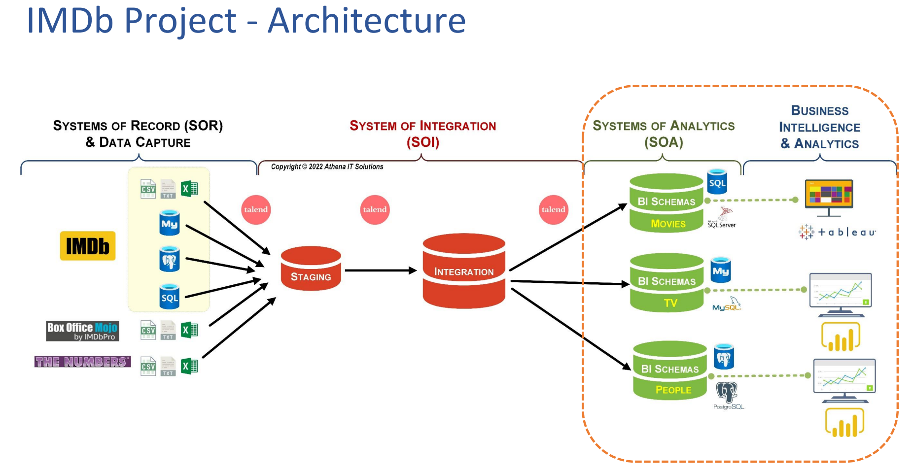

# IMDB Data Warehousing and Business Intelligence

## Data Staging:

In the staging phase, data is loaded from various sources, including CSV, TSV, and DB backup files. The data encompasses movies, TV shows, short movies, videos, box office brands, franchises, and genres.

### Data Transformation with t_convert

The **t_convert** component is used to transform data between different formats and data types, ensuring compatibility and consistency across systems. This step facilitates seamless integration and processing of data, promoting efficient data management.

### Data Cleansing with t_replace

To ensure data accuracy and uniformity, the **t_replace** component is employed for data cleansing. It allows for the identification of patterns or values and their substitution with desired alternatives. By standardizing the data and eliminating special characters and null values, data quality is enhanced.

### Data Deduplication with t_unique

Maintaining data integrity and improving data quality is achieved through the **t_unique** component, which identifies and eliminates duplicate records. By ensuring a single, unique representation of each record, redundancy is minimized and data consistency is ensured.

### File Structural Issues Check

Before loading data into staging tables, it is crucial to implement a validation process to identify any file structural issues. This includes checking for delimiter mismatches in TSV and CSV files. By verifying the correctness and compatibility of the file structure, such as delimiters and row counts, data ingestion errors are prevented, and the accuracy and integrity of the loaded data in Talend are ensured.

The above components are utilized within the staging phase to clean the raw data. This includes handling null values, special characters, and converting data types to match the corresponding fields derived from different sources. The cleaned data is then prepared for further processing in the integration stage.

## Data Integration

### Data Consistency and Dimensional Modeling

The integration stage involves loading data into a dimensional model that ensures data consistency. This model comprises dimensions and facts, providing a structured framework for analysis and processing.

### Data Normalization with t_normalize

The **t_normalize** component plays a crucial role in organizing data into a consistent and structured format. By reducing redundancy and enhancing data integrity, it simplifies analysis and processing, improving overall data quality.

### Data Refinement with t_filter

The **t_filter** component allows for precise data refinement by applying criteria or conditions to include or exclude specific data records. By focusing on relevant and desired data, it improves efficiency and accuracy, optimizing the integration process.

### Rejection Processing for Data Integrity

To maintain data integrity, a rejection processing mechanism is incorporated during data integration. This mechanism assigns rejection codes and descriptions to rejected records, aiding in the identification and management of such data. This check ensures the integrity and reliability of the integrated data.

These processes collectively ensure data consistency, integrity, and quality throughout the integration stage, promoting accurate analysis and reliable insights.

## Workflow Tracking and Data Consistency

In every Talend job, the following practices are implemented to track the workflow and ensure data consistency:

1. Mandatory Data Fields:

   - All rows processed in the job must have the DI_JobID and DI_CreateDT fields filled in.
   - DI_JobID provides a unique identifier for each record, facilitating traceability and association with a specific job.
   - DI_CreateDT captures the creation timestamp, enabling temporal tracking and auditing of the data.

2. Job Statistics Processing Joblets:

   - Each job incorporates Job Statistics Processing Joblets to capture runtime information.
   - These Joblets log essential details such as start time, end time, duration, and other pertinent statistics.
   - The collected runtime data serves as valuable metrics for monitoring and analysis.

3. DI_CNTL Database:
   - A designated DI_CNTL database is utilized to store and manage job runtime information.
   - The database acts as a centralized repository for tracking and documenting job execution details.
   - It enables comprehensive monitoring, analysis, and reporting of job performance.

By adhering to these practices, i established a standardized workflow tracking mechanism across Talend jobs. The mandatory data fields ensure consistent metadata capture, while the Job Statistics Processing Joblets and DI_CNTL database provide insights into job runtime and facilitate comprehensive monitoring and analysis.
